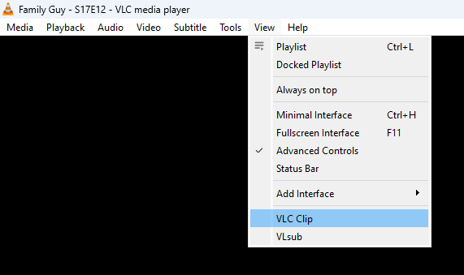
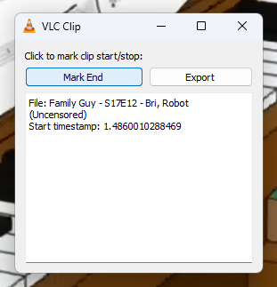
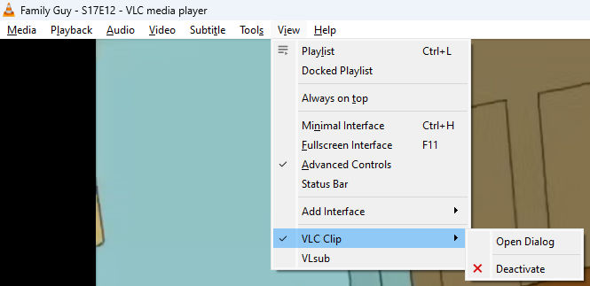

# VLC Clip

VLC extension to more easily curate my Family Guy Funny Moments.


## Installation

1. Download `VLC-Clip.luac`.
2. Copy `VLC-Clip.luac` to your VLC extensions directory. For Windows, that should be:

   ```
   C:\Program Files\VideoLAN\VLC\lua\extensions\
   ```

3. Edit the very first line of `VLC-Clip.luac` to the destination you want the clips. You probably don't want this:
   ```
   parentPath = "C:\\Users\\nathan\\Videos\\VLC Exports\\"
   ```

4. Install [ffmpeg](https://ffmpeg.org/download.html) such that you can invoke it by just running `ffmpeg` in a
   terminal.

## Usage

1. Go to View -> VLC Clip.

   

2. Click the "Mark Start" and "Mark End" buttons at the start/end timestamps you want for your clip.

   

3. If you messed up and you want to redo it, you can restart by clicking "Mark Start" after you've already marked the
   end.
4. When you've set the start/end timestamps, export the clip by clicking "Export".
5. To reopen the dialog after you close it, enter the menu View --> VLC Clip --> Open Dialog.

   

The plugin is pretty quick and dirty (the VLC extension API documentation is awful). Just don't do weird edge-cases and
you'll be fine.